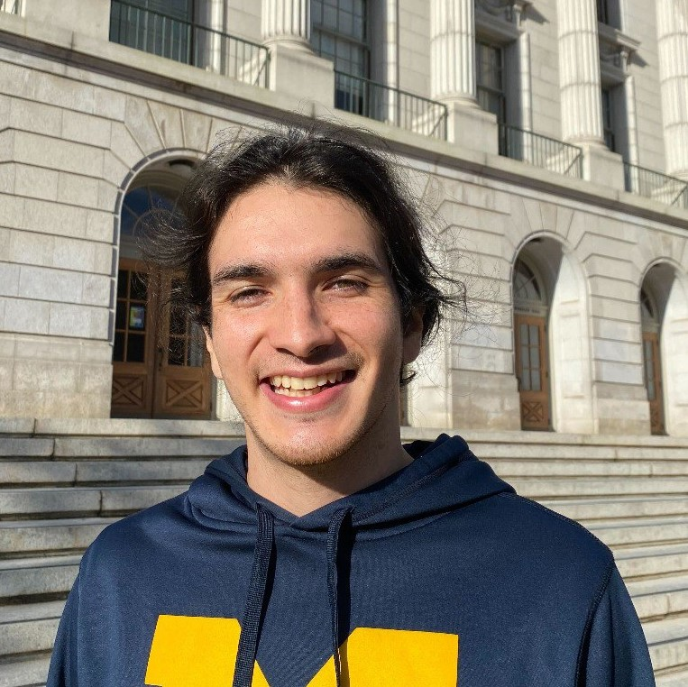

Tyrone's Website

  

Hello, this is my personal website for CSS. 

I am currently a Ph.D. student in the Social-Personality Psychology program here at Berkeley, working primarily in the Relationships and Social Cognition Lab (RASCL) and the Berkeley Social Interaction Lab (BSIL). Before coming here, I completed my B.S. in psychology, cognitive science, and philosophy at the University of Michigan, where I worked in the Emotion and Self-Control lab directed by Professor Ethan Kross. Currently, my research focuses on intellectual humility and explaining the relationship between psychedelics and well-being. I am also interested in emotion-regulation.

